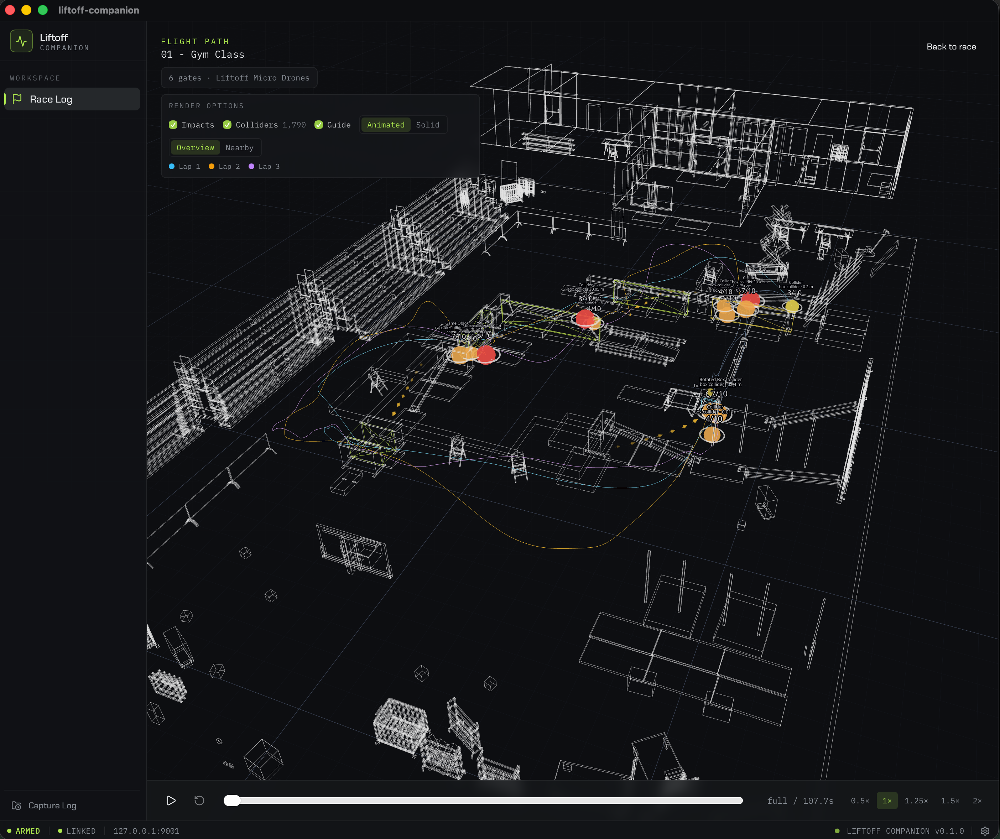
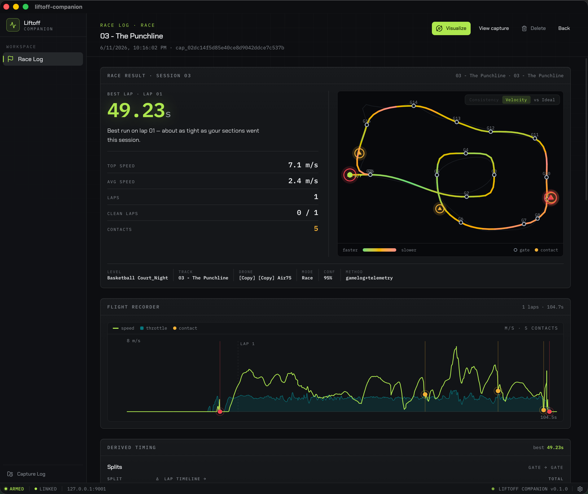
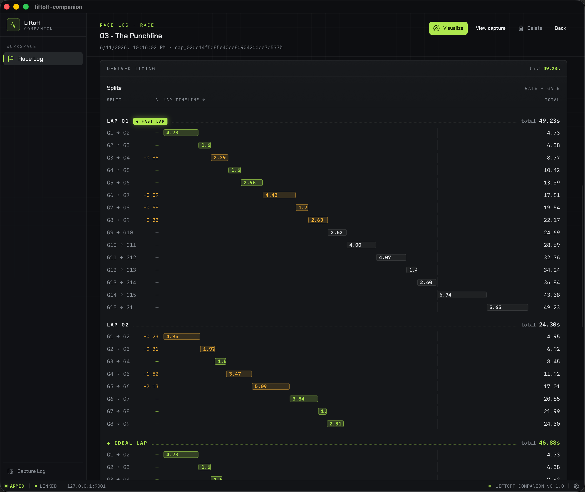
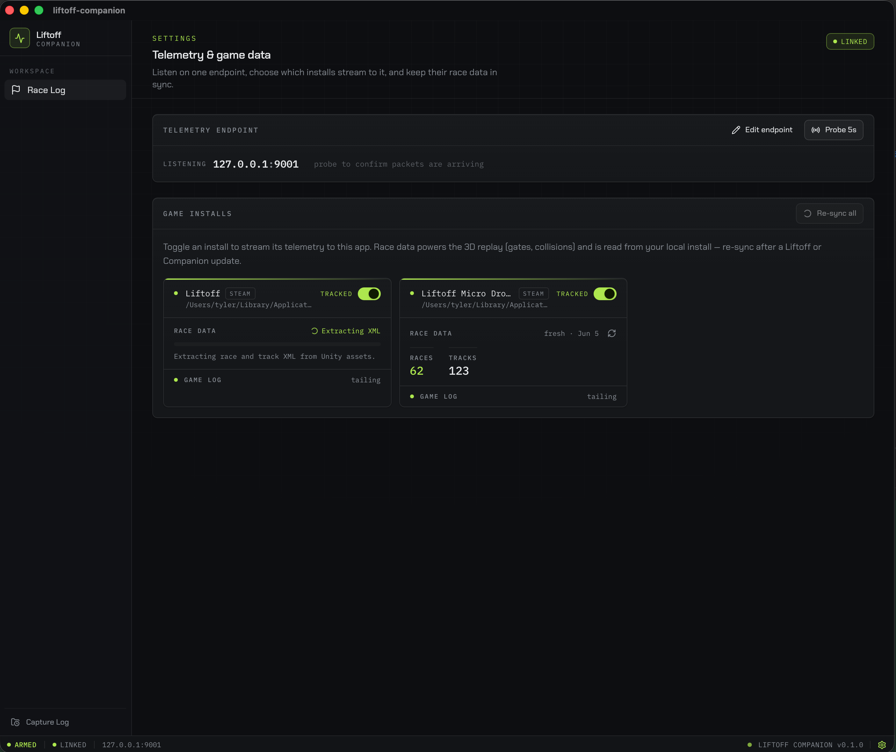

# Liftoff Companion

Liftoff Companion is an experimental desktop app for reviewing FPV simulator
runs after you fly them in Liftoff. It records Liftoff telemetry, watches the
game log for track and race context, then turns that data into a local flight
library with sessions, charts, race details, collision markers, and 3D flight
path views.

The goal is to make practice sessions easier to inspect after the fact: what
track you flew, where a run started and ended, how fast you were moving, where
you hit obstacles, and how individual race sessions compare over time.

## Screenshots

### 3D Flight Visualization



### Race Details



### Race Timing



### Settings



## Status

This repository is 100% vibe-coded as an experiment. Expect rough edges,
unfinished workflows, and implementation choices that may change quickly.

## Important Disclaimer

This project is not affiliated with, endorsed by, sponsored by, or supported by
LuGus Studios or the Liftoff developers.

Liftoff Companion does not include, replace, unlock, or redistribute any Liftoff
game content. To use it, you need a legitimate Steam purchase and local
installation of at least one supported Liftoff title:

- [Liftoff: FPV Drone Racing](https://store.steampowered.com/app/410340/Liftoff_FPV_Drone_Racing/)
- [Liftoff: Micro Drones](https://store.steampowered.com/app/1432320/Liftoff_Micro_Drones/)

## What It Does

- Configures Liftoff telemetry for a local UDP listener.
- Records raw telemetry packets into append-only `.rawcap` files.
- Watches Liftoff `Player.log` files to identify loaded tracks, races, flight
  windows, pauses, and drone resets.
- Splits captures into race sessions using game-log context and telemetry.
- Stores captures, sessions, jobs, and extracted course metadata in a local
  SQLite database.
- Reprocesses old captures as the analysis logic improves.
- Shows session summaries, speed charts, race detail views, collision markers,
  and 3D flight paths.
- Includes `fake_liftoff` and `fake_gamelog` development helpers so the app can
  be exercised without launching the game.

## How It Works

Liftoff Companion is a black-box recorder and analysis tool. During capture, it
listens for telemetry packets from Liftoff and records them exactly as received.
At the same time, it can tail the local Liftoff game log to attach useful
context such as level, race, and flight state.

Analysis happens after recording. The app reads the raw capture back, verifies
its hash, segments the flight into sessions, estimates race timing and impact
events, and builds views for review. The original capture stays available so it
can be reprocessed later.

## Requirements

- A legitimate Steam install of Liftoff: FPV Drone Racing or Liftoff: Micro
  Drones.
- Node.js and npm for the React frontend.
- Rust and Cargo for the Tauri backend.
- A controller or radio setup supported by Liftoff if you want to fly real runs.

## Running The App

Install dependencies:

```sh
npm install
```

Run the full desktop app:

```sh
npm run tauri dev
```

For frontend-only development:

```sh
npm run dev
```

## First-Time Use

1. Launch Liftoff once so it creates its local configuration and log folders.
2. Start Liftoff Companion.
3. Open Setup and confirm the app detects your Liftoff install and game log.
4. Use "Configure Liftoff Telemetry" to write the telemetry configuration the
   recorder expects. The app backs up an existing config before replacing it.
5. Reset your drone or restart Liftoff so the game re-reads the telemetry config.
6. Start a capture, fly a run, stop the capture, then review it in the app.

## Development Helpers

Emit synthetic telemetry packets:

```sh
cd src-tauri
cargo run --bin fake_liftoff -- --rate-hz 100
```

Append synthetic game-log events to a local log file:

```sh
cd src-tauri
cargo run --bin fake_gamelog -- \
  --path "$HOME/Library/Logs/LuGus Studios/Liftoff Micro Drones/Player.log" \
  --tracks 2 --fly-secs 8
```

## Commands

| Task | Command |
|---|---|
| Run full desktop app | `npm run tauri dev` |
| Run frontend only | `npm run dev` |
| Type-check and bundle frontend | `npm run build` |
| Preview built frontend | `npm run preview` |
| Build packaged Tauri app | `npm run tauri build` |
| Rust check | `cd src-tauri && cargo check` |
| Rust tests | `cd src-tauri && cargo test` |
| Rust clippy | `cd src-tauri && cargo clippy --lib --bins --tests` |

## Project Layout

```text
src/                      React frontend
src/pages/                Main app screens
src/components/           Shared UI components
src/lib/                  Frontend API wrappers, events, types, and helpers

src-tauri/                Tauri/Rust backend
src-tauri/src/capture/    Raw telemetry recorder and rawcap reader/writer
src-tauri/src/gamelog/    Liftoff Player.log tailing and segmentation
src-tauri/src/liftoff/    Liftoff paths, config writer, and asset extraction
src-tauri/src/processing/ Capture replay, timing, collisions, and jobs
src-tauri/src/storage/    SQLite migrations and repositories
src-tauri/src/telemetry/  Liftoff telemetry schema and packet parser
src-tauri/src/bin/        Local development helper binaries
src-tauri/tests/          Rust integration tests
```

## Data And Privacy

The app stores captures and analysis data locally on your machine. Captures can
include raw telemetry, race/session metadata, and snippets of parsed game-log
state. Do not publish your generated app data unless you are comfortable sharing
that flight-session information.

## License

Liftoff Companion is released under the [MIT License](LICENSE).

## Liftoff Telemetry Reference

Packet layout follows the order of the `StreamFormat` array in
`TelemetryConfiguration.json`. The canonical config this app writes enables all
fields in this order:

```text
Timestamp  Position  Attitude  Velocity  Gyro  Input  Battery  MotorRPM
```

With a quad that has four motors, that is 97 bytes per packet using little-endian
`f32` values throughout. Attitude is a quaternion in X, Y, Z, W order.
